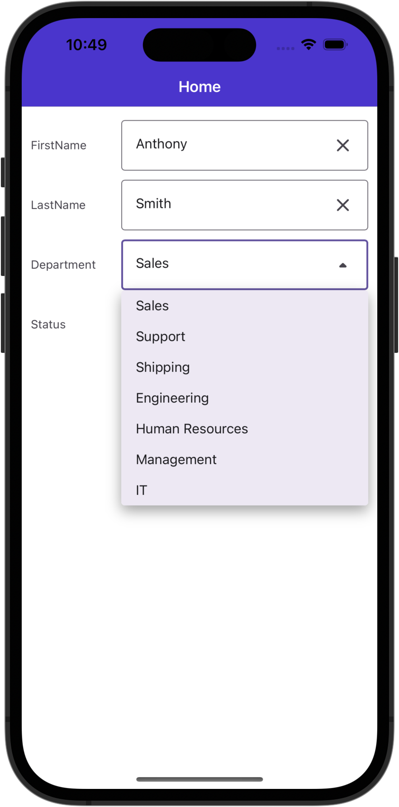
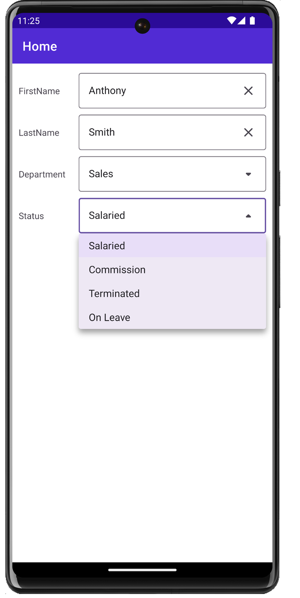

# DevExpress Data Form for .NET MAUI - Add a ComboBoxEdit

This example shows how to display a [ComboBoxEdit](https://docs.devexpress.com/Maui/DevExpress.Maui.Editors.ComboBoxEdit) in the [DataFormView](https://docs.devexpress.com/Maui/DevExpress.Maui.DataForm.DataFormView) control.

The [DataFormView](https://docs.devexpress.com/Maui/DevExpress.Maui.DataForm.DataFormView) generates [ComboBoxEdit](https://docs.devexpress.com/Maui/DevExpress.Maui.Editors.ComboBoxEdit) editors for the underlying data object's properties of the *enum* type. You can also bind a combo box editor to a collection that stores objects of any type - for example, primitive types (strings, integers, etc.) or custom objects. 

 

### Configure Combo Box Settings

To specify an item source for the data form's combo box editor, follow the steps below:

1. Create a class that implements the [IPickerSourceProvider](https://docs.devexpress.com/Maui/DevExpress.Maui.DataForm.IPickerSourceProvider) interface. An instance of this class (*ComboBoxDataProvider* in this example) serves as the data source for all combo box editors within the data form. 
2. Override the [GetSource](https://docs.devexpress.com/Maui/DevExpress.Maui.DataForm.IPickerSourceProvider.GetSource(System.String)) method so that it returns an item source for a combo box based on the data object property to which the editor is bound.
3. Set the [DataFormView.PickerSourceProvider](https://docs.devexpress.com/Maui/DevExpress.Maui.DataForm.DataFormView.PickerSourceProvider) property to a *ComboBoxDataProvider* class instance.
4. Add the [DataFormComboBoxItem](https://docs.devexpress.com/MAUI/DevExpress.Maui.DataForm.DataFormComboBoxItem) to the [DataFormView](https://docs.devexpress.com/Maui/DevExpress.Maui.DataForm.DataFormView) and specify the item's [FieldName](https://docs.devexpress.com/MAUI/DevExpress.Maui.DataForm.DataFormItem.FieldName) to assign a combo box editor to the data object's property.   
In this example, the data form is bound to the *EmployeeInfo* object and uses combo box editors for the following properties of this object:
    - *Department*  
    The data provider's `GetSource` method returns a list of `DepartmentInfo` objects that serve as the data source for the drop-down item list of the **Department** combo box. Use the [ValueMember](https://docs.devexpress.com/MAUI/DevExpress.Maui.DataForm.DataFormComboBoxItem.ValueMember) and [DisplayMember](https://docs.devexpress.com/MAUI/DevExpress.Maui.DataForm.DataFormComboBoxItem.DisplayMember) parameters to specify data source field names that supply item values (integer values that define department codes) and display strings (department names), respectively.
    - *Status*  
    The data provider's `GetSource` method returns a list of strings that are displayed as items within the **Status** combo box and used to set the data object's *Status* property value.

### Specify Editor Navigation Settings

When a user taps a [DataFormView](https://docs.devexpress.com/Maui/DevExpress.Maui.DataForm.DataFormView) editor, its state changes to Focused and the on-screen keyboard appears. The user can tap the **Next** button on the keyboard to move to the next editor in the [DataFormView](https://docs.devexpress.com/Maui/DevExpress.Maui.DataForm.DataFormView). The [DataFormView](https://docs.devexpress.com/Maui/DevExpress.Maui.DataForm.DataFormView) shows the **Next** button for a focused editor if its [ReturnType](https://docs.devexpress.com/MAUI/DevExpress.Maui.DataForm.DataFormTextItemBase.ReturnType) property is set to `Next`. To show the keyboard for a [combo box editor](https://docs.devexpress.com/MAUI/DevExpress.Maui.DataForm.DataFormComboBoxItem), you should additionally set its [IsFilterEnabled](https://docs.devexpress.com/MAUI/DevExpress.Maui.DataForm.DataFormComboBoxItem.IsFilterEnabled) property to `True`.

The `TabIndex` property allows you to define the order of editors when they are traversed. Use positive integers to specify indexes. 

## Files to Review

* [MainPage.xaml](MainPage.xaml)
* [MainPage.xaml.cs](MainPage.xaml.cs)

## Documentation

* [Customize .NET MAUI Control Appearance](https://docs.devexpress.com/MAUI/404147/customize-appearance)
* [DataFormView class - Appearance Properties](https://docs.devexpress.com/MAUI/DevExpress.Maui.DataForm.DataFormView#data-form-views-items)

## More Examples

* [Get Started with the DataForm](../DataFormGetStarted)
* [Customize a DataFrom Appearance](../CustomAppearance)
* [Add/Remove Data Editors at Runtime](../AddingDataEditorsAtRuntime)

