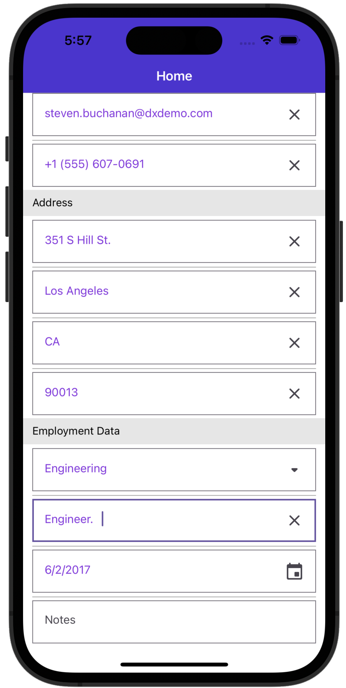
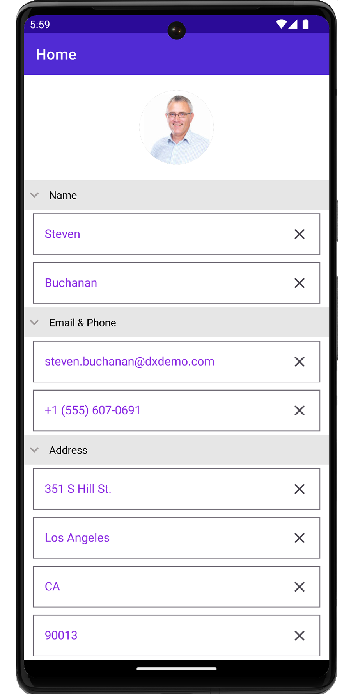

# DevExpress Data Form for .NET MAUI - Customize Appearance

This example describes how to customze the appearance of the Data Form and its items.

You can customize the data form's appearance in the following ways:
- Use [implicit styles](https://docs.devexpress.com/MAUI/404147/customize-appearance#use-implicit-styles-for-centralized-style-management) to modify the appearance of all data form and editor instances that use these resources. 
- Use [DataFormView](https://docs.devexpress.com/Maui/DevExpress.Maui.DataForm.DataFormView) object properties to customize a specific data form instance.

 

## Files to Review

* [MainPage.xaml](MainPage.xaml)
* [MainPage.xaml.cs](MainPage.xaml.cs)
* [EmployeeInfo.cs](EmployeeInfo.cs)

## More Examples

* [Get Started with the DataForm](../DataFormGetStarted)
* [Display a ComboBoxEdit in the DataForm](../ComboBoxEditor)
* [Add/Remove Data Editors at Runtime](../AddingDataEditorsAtRuntime)

