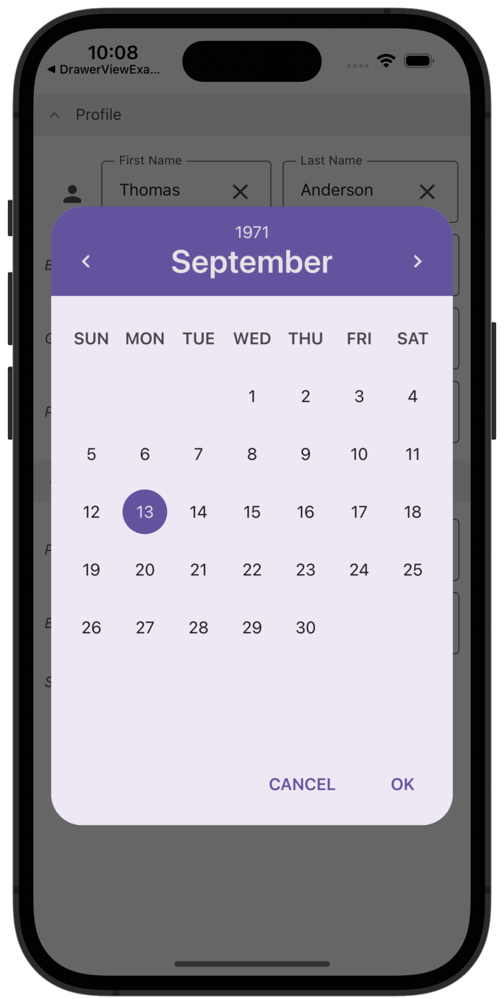
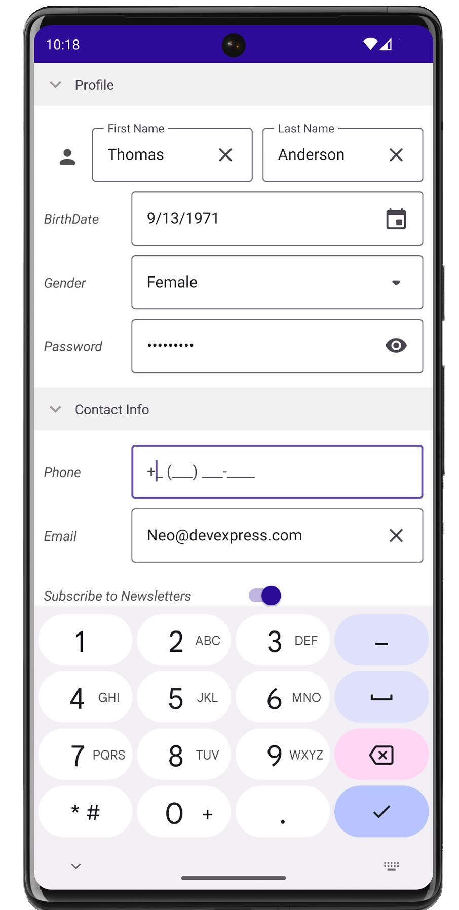

# DevExpress Data Form for .NET MAUI - Get Started

The following topic describes how to get started with the DataForm Control for .NET MAUI.

 

You can also refer to the following YouTube video for instructions on how to get started with the Data Form Control: [Adding a Data Form to Your .NET MAUI App](https://www.youtube.com/watch?v=imUCmru5Lwc&ab_channel=DevExpress).

## Files to Review

* [MainPage.xaml](MainPage.xaml)
* [MainPage.xaml.cs](MainPage.xaml.cs)

## Documentation

* [Get Started with DevExpress Data Form for .NET MAUI](https://docs.devexpress.com/MAUI/403647/data-form/get-started)
* [DataForm.DataFormView](https://docs.devexpress.com/MAUI/DevExpress.Maui.DataForm.DataFormView)

## More Examples

* [Display a ComboBoxEdit in the DataForm](../ComboBoxEditor)
* [Customize a DataFrom Appearance](../CustomAppearance)
* [Add/Remove Data Editors at Runtime](../AddingDataEditorsAtRuntime)

