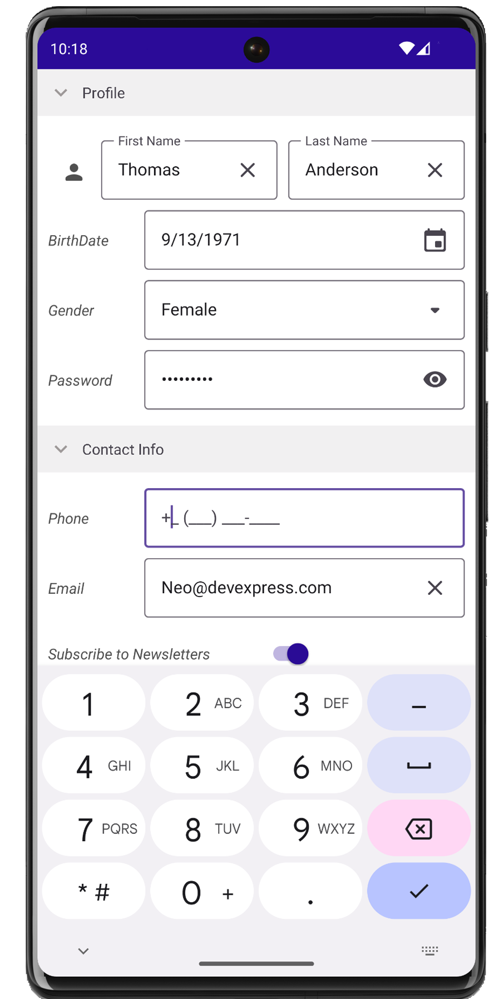
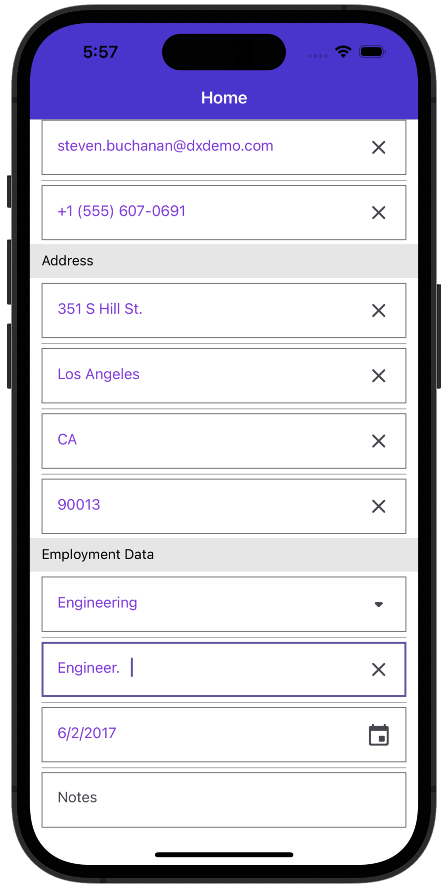
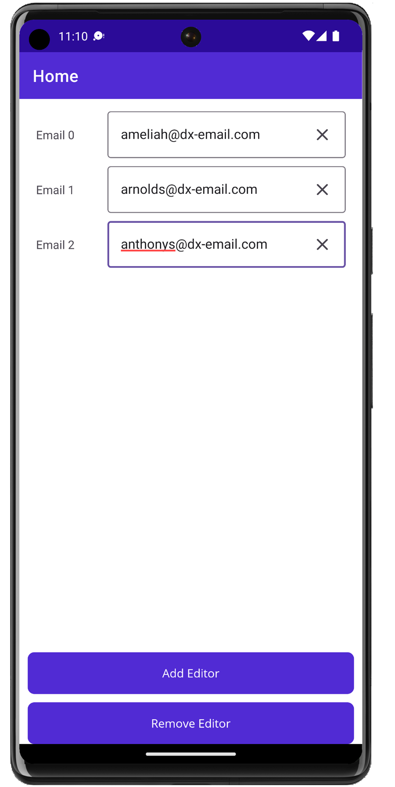
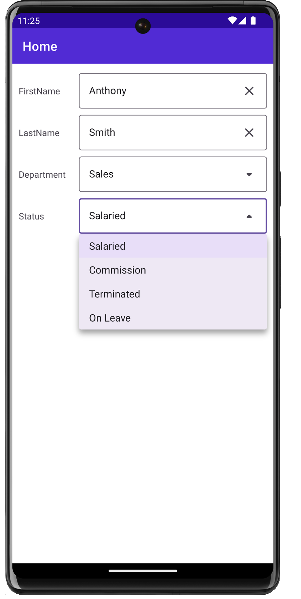

<!-- default badges list -->

<!-- default badges end -->
# DevExpress Data Form for .NET MAUI

[DevExpress Mobile UI](https://www.devexpress.com/maui/) allows you to use a .NET cross-platform UI toolkit and C# to build native apps for iOS and Android.

The **DevExpress Mobile UI for Xamarin.Forms and .NET MAUI** is free of charge. To learn more about our offer and obtain your copy, visit [Free DevExpress Mobile UI for Xamarin.Forms and .NET MAUI](https://www.devexpress.com/xamarin-free).

## Requirements

You need to register the DevExpress NuGet Gallery in Visual Studio to restore the NuGet packages used in this solution. See the following topic for more information: [Get Started with DevExpress Mobile UI for .NET MAUI](https://docs.devexpress.com/MAUI/403249/get-started).

You can also refer to the following YouTube video for instructions on how to get started with the DevExpress .NET MAUI Controls: [Setting up a .NET MAUI Project](https://www.youtube.com/watch?v=juJvl5UicIQ).

## What's in This Repository

### Get Started with DevExpress Data Form for .NET MAUI

The [Getting Started](./CS/DataFormGetStarted/) project demonstrates the capabilities of the **DevExpress Data Form for .NET MAUI** &#8212; a control that allows you to display and edit data objects.

 

See the following help topic for more information: [DevExpress Data Form for .NET MAUI](https://docs.devexpress.com/MAUI/403640/data-form).

You can also refer to the following YouTube video for instructions on how to get started with the Data Form Control: [Adding a Data Form to Your .NET MAUI App](https://www.youtube.com/watch?v=imUCmru5Lwc&ab_channel=DevExpress).

### Customize the Data Form Appearance

The [CustomAppearance](./CS/CustomAppearance/) project shows how to customize the appearance of Data Form items.

 

### Add and Remove DataFormItems at Runtime

The [AddingDataEditorsAtRuntime](./CS/AddingDataEditorsAtRuntime/) project shows how to add and remove Data Form items at runtime.

 

### Display ComboBox

The [ComboBoxEditor](./CS/ComboBoxEditor/) project shows how to display a ComboboxEdit control within the Data Form.

 

## Documentation

- [Data Grid](https://docs.devexpress.com/MAUI/403255/data-grid/data-grid)
- [Charts](https://docs.devexpress.com/MAUI/403300/charts/charts)
- [Data Form](https://docs.devexpress.com/MAUI/403640/data-form)
- [Navigation](https://docs.devexpress.com/MAUI/403297/navigation/index)
- [Data Editors](https://docs.devexpress.com/MAUI/403427/editors/index)
- [Collection View](https://docs.devexpress.com/MAUI/403324/collection-view/index)

## More Examples

* [Stocks App](https://github.com/DevExpress-Examples/maui-stocks-mini)
* [Data Grid](https://github.com/DevExpress-Examples/maui-data-grid-get-started)
* [Data Editors](https://github.com/DevExpress-Examples/maui-editors-get-started)
* [Charts](https://github.com/DevExpress-Examples/maui-charts)
* [Scheduler](https://github.com/DevExpress-Examples/maui-scheduler-get-started)
* [Tab Page](https://github.com/DevExpress-Examples/maui-tab-page-get-started)
* [Tab View](https://github.com/DevExpress-Examples/maui-tab-view-get-started)
* [Drawer Page](https://github.com/DevExpress-Examples/maui-drawer-page-get-started)
* [Drawer View](https://github.com/DevExpress-Examples/maui-drawer-view-get-started)
* [Collection View](https://github.com/DevExpress-Examples/maui-collection-view-get-started)
* [Popup](https://github.com/DevExpress-Examples/maui-popup-get-started)
<!-- feedback -->
## Does this example address your development requirements/objectives?

 

(you will be redirected to DevExpress.com to submit your response)
<!-- feedback end -->
